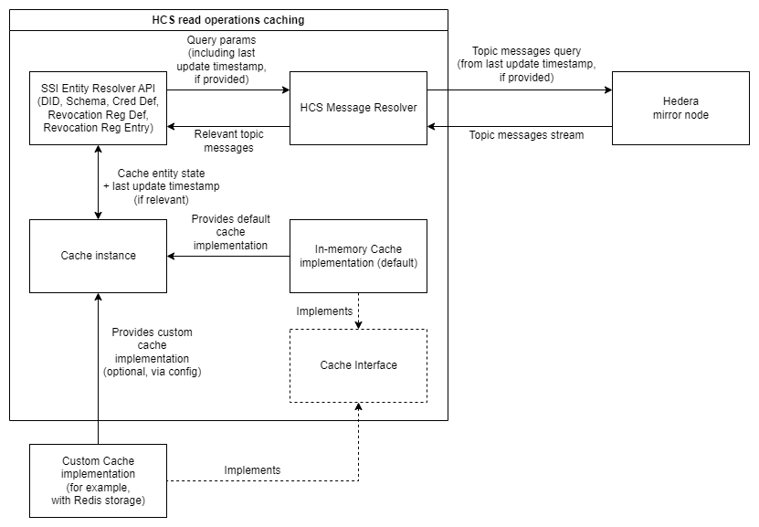

# HCS read operations caching

## Description

This document contains analysis and technical design for HCS read operations caching/optimization approach.

## SSI entities storage approach and performance concerns

- General approach for storing SSI entities is based on Hedera Consensus Service (HCS) messaging
  - Enables publish/subscription functionality for arbitrary messages grouped in topics (by topicId)
  - Such topic messages are ordered by timestamp (as any other transaction), message reading is performed using [Hedera mirror node](https://github.com/hashgraph/hedera-mirror-node)
- For instance, DID Document approach is the following:
  - Every DID have unique HCS topic
  - Topic messages represent create-update-delete operations on specific DID document and it's properties
  - Registrar implementation just needs to publish CREATE message for DID
  - Resolver implementation needs to read all DID topic messages (from start to current timestamp) to resolve it's current state
    - Reading is done by subscribing to message stream from mirror node and processing them one by one
- Above-mentioned approach is described in Hedera DID method specification and Java DID SDK docs + the rationale for managing SSI entities in HCS can be found in some older articles
  - [Hedera DID method spec](https://github.com/hashgraph/did-method/blob/master/hedera-did-method-specification.md)
  - [did-sdk-java docs](https://github.com/hashgraph/did-sdk-java/blob/main/docs/did-user-guide.md)
  - [Older article with rationale for implementation based on HCS messages](https://hedera.com/blog/decentralized-identity-on-hedera-consensus-service)
- Hedera mirror node dev team is doing great job on maximizing reading performance
  - [GH repo](https://github.com/hashgraph/hedera-mirror-node)
  - This includes CDNs + distributed Postgres DB ([Citus](https://www.citusdata.com/)), Redis cache + caching strategy on app level which minimize DB requests, query processing optimizations and etc.
  - Development is quite active, but overall mirror node performance is expected to be at best condition possible
- However, client-side reading is still not optimal and can introduce issues - redundant network requests and waiting for messages stream will eventually create a bottleneck
  - Problematic points of such approach are also mentioned in [did-sdk-java docs](https://github.com/hashgraph/did-sdk-java/blob/main/docs/did-user-guide.md#read-resolve)
  - If we think about application that reads all topic messages for DID resolution - performance issues are inevitable, but may become visible only in the long run
    - Good example - Indy VDR performance issues on entities resolution, were discovered by Bifold/BC Wallet team while using older Indy networks with a lot of transactions
    - Indy VDR reading operations had similar problems but these were not critical or even noticeable for a long time

## Optimization options analysis

DID Document spec is a good example of HCS-stored SSI entity that supports granular updates (which is also optimal from HCS perspective).

Following analysis is based on DID Document, but can be applied to any potential entity stored in a similar way:

- The main problem of DID Document HCS messages is that they do not store actual state, just messages with CRUD operations
  - According to latest [Hedera DID spec](https://github.com/hashgraph/did-method/blob/master/hedera-did-method-specification.md), 'update' and 'revoke' operations contain only changed properties of entity
  - This is actually more complex than in previous version of Hedera DID spec (v0.9) - there a whole DID Document object was attached to 'update' operation
- This means that resolver needs to re-build the state of DID Document based on topic messages
- Messages content is not needed after we apply it to document state, so it makes sense to cache state of entity + timestamp of the last update
  - This will allow resolver to retrieve cached (and potentially outdated) state and read only new messages to apply any state updates

Similar logic can be applied to immutable entities stored as [HCS-1](https://hashgraphonline.com/docs/standards/hcs-1/) files:

- HCS-1 file is stored as HCS messages representing file chunks, so caching of actual file contents allows to avoid reading HCS message stream multiple times
- The difference will be that HCS-1 files are immutable - there is no need for tracking last update timestamp and checking for state updates

### Customization approach

- It makes sense to provide an interface for cache implementation to support cases where end-applications want to customize cache storage (Redis, file systems, etc.)
- For convenience, default cache implementation needs to be provided - it was decided to implement basic in-memory cache that also includes simple clean-up/data retention mechanism

## Caching approach diagram

## Source code references

- [Cache interface and in-memory implementation](../../hiero_did_sdk_python/utils/cache.py)
- Classes that utilize cache instance
  - [HederaDidResolver](../../hiero_did_sdk_python/did/hedera_did_resolver.py)
  - [HederaAnonCredsRegistry](../../hiero_did_sdk_python/anoncreds/hedera_anoncreds_registry.py)
