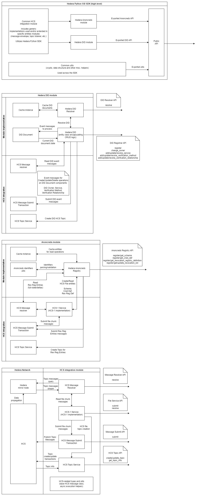

# High-level architecture

## Project structure

Internal SDK structure includes following modules:

- DID module
  - [Src link](../../hiero_did_sdk_python/did)
  - Contains Hedera DID management logic and API according to latest [Hedera DID spec](https://github.com/hashgraph/did-method/blob/master/hedera-did-method-specification.md)
  - Provides public Hedera DID management API (resolver + registrar functionality)
- AnonCreds module
  - [Src link](../../hiero_did_sdk_python/anoncreds)
  - Contains AnonCreds Registry implementation that use Hedera as VDR (specifically, Hedera Consensus Service)
  - Provides Hedera AnonCreds Registry as a public API
  - Technical design notes can be found in [Hedera AnonCreds Method page](hedera-anoncreds-method.md)
  - Public API structure is inspired by [ACA-Py AnonCreds Registry use case](https://aca-py.org/latest/features/AnonCredsMethods/)
- Hedera Consensus Service (HCS) integration module
  - [Src link](../../hiero_did_sdk_python/hcs)
  - Contains HCS integration logic and API used across the SDK
  - Not a part of public API

## Diagrams

